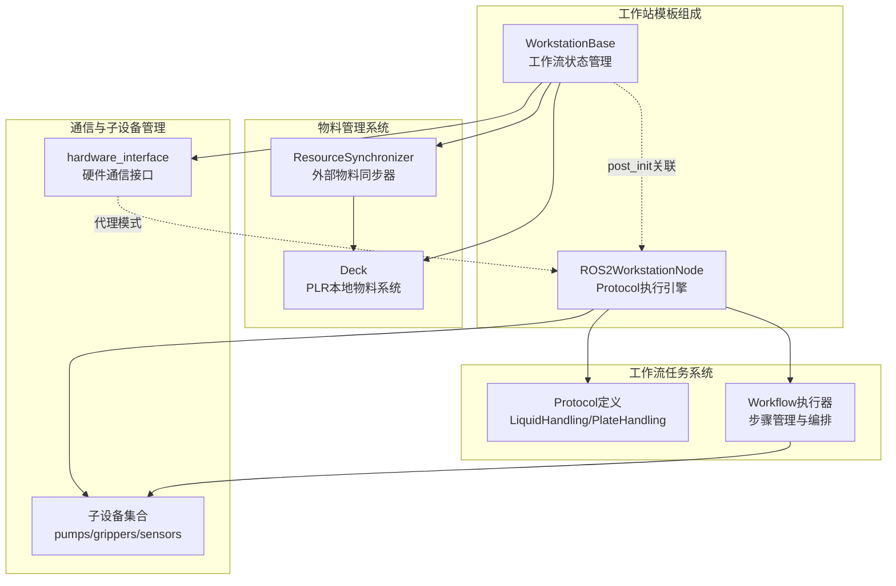
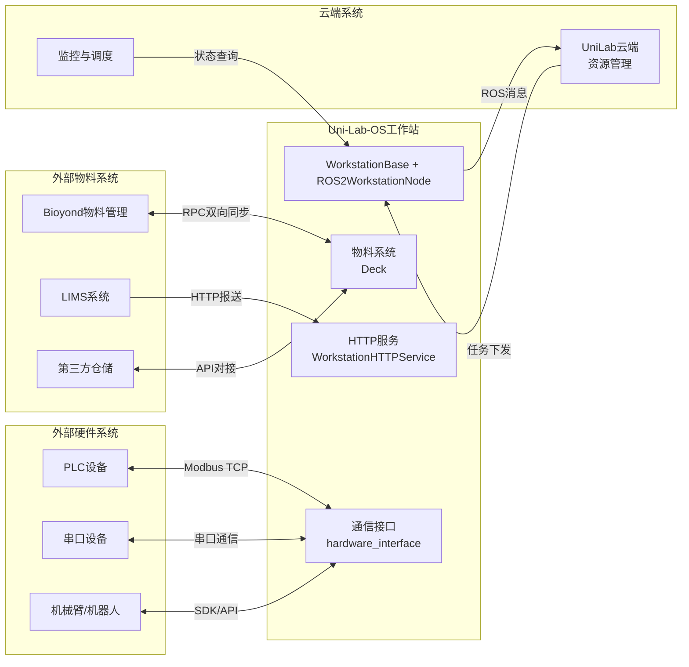
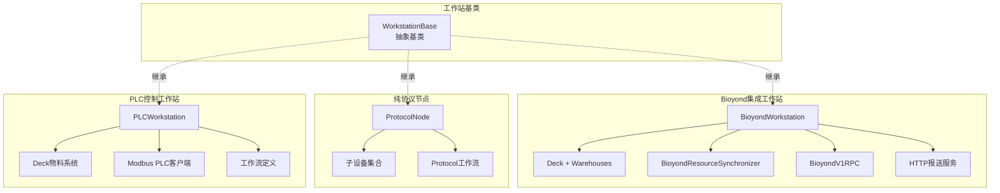
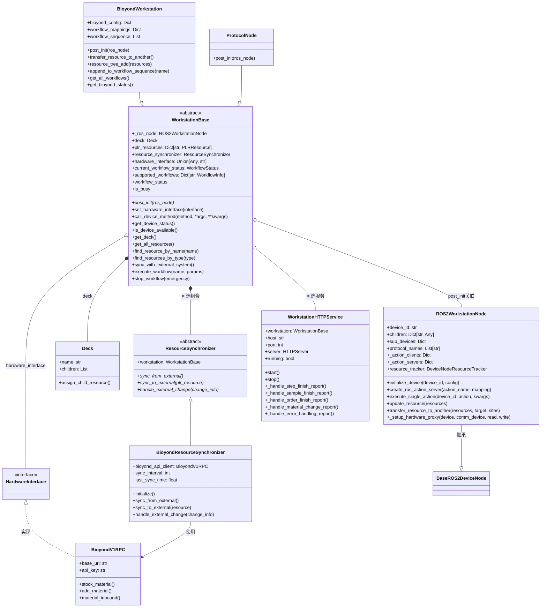
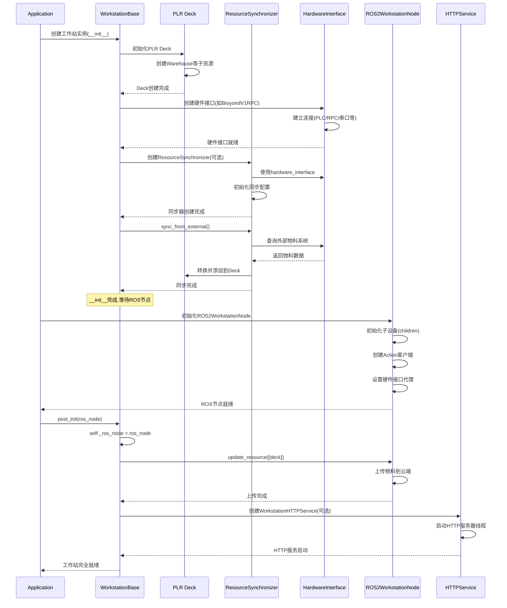
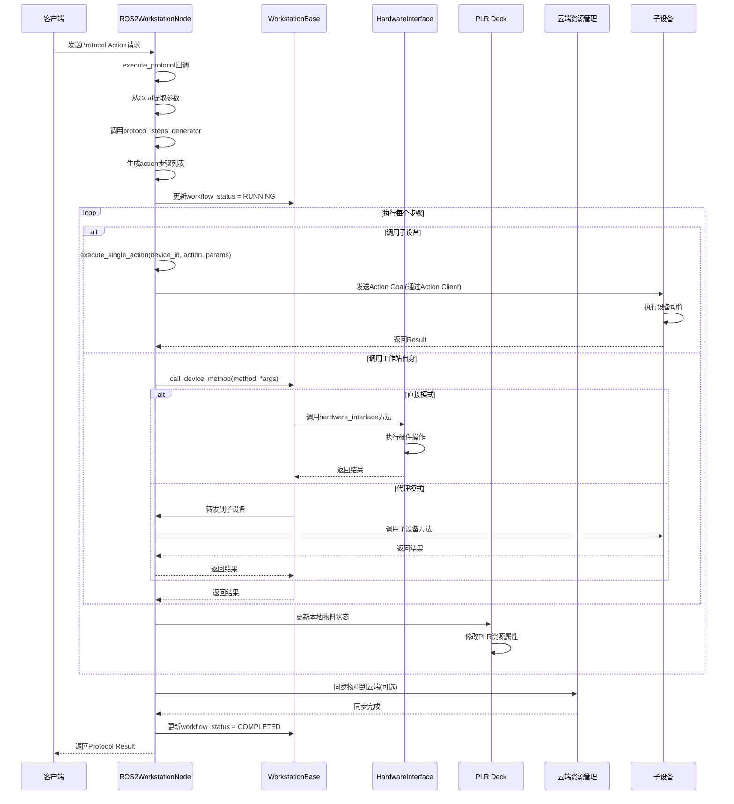
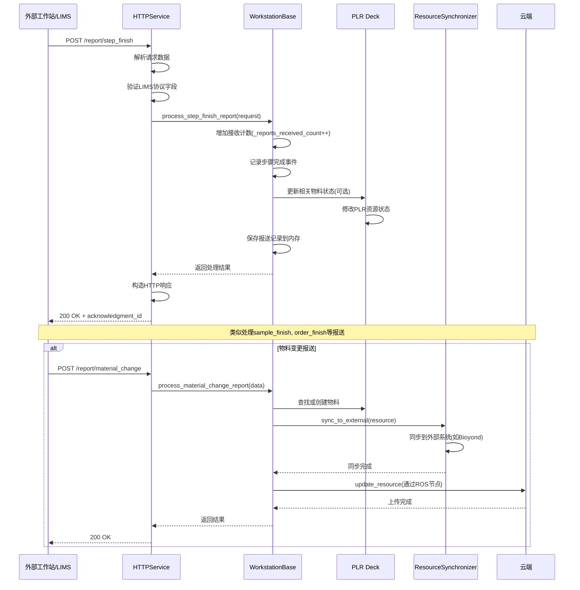
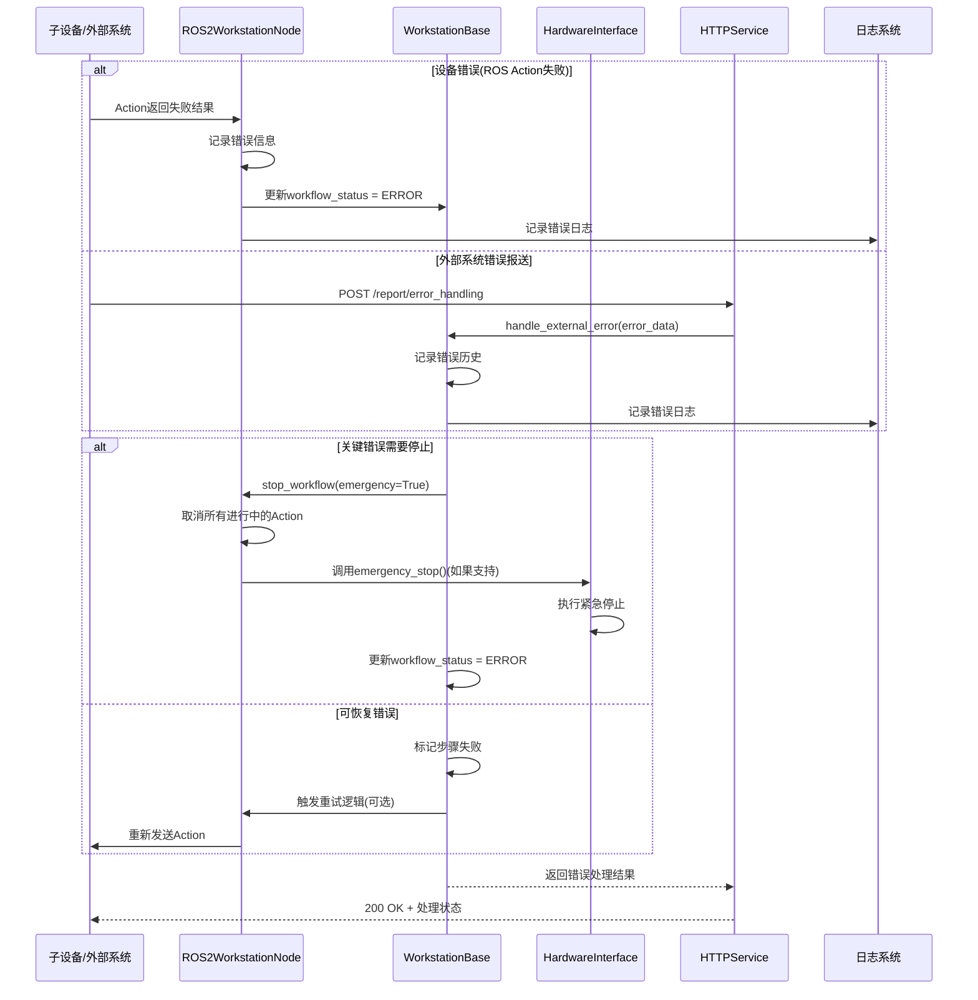

# 实例：工作站模板架构设计与对接指南

> **文档类型**：架构设计指南与实战案例  
> **适用场景**：大型工作站接入、子设备管理、物料系统集成  
> **前置知识**：{doc}`../add_device` | {doc}`../add_registry`

## 0. 问题简介

我们可以从以下几类例子，来理解对接大型工作站需要哪些设计。本文档之后的实战案例也将由这些组成。

### 0.1 自研常量有机工站：最重要的是子设备管理和通信转发


这类工站由开发者自研，组合所有子设备和实验耗材、希望让他们在工作站这一级协调配合；

1. 工作站包含大量已经注册的子设备，可能各自通信组态很不相同；部分设备可能会拥有同一个通信设备作为出口，如 2 个泵共用 1 个串口、所有设备共同接入 PLC 等。
2. 任务系统是统一实现的 protocols，protocols 中会将高层指令处理成各子设备配合的工作流 json 并管理执行、同时更改物料信息
3. 物料系统较为简单直接，如常量有机化学仅为工作站内固定的瓶子，初始化时就已固定；随后在任务执行过程中，记录试剂量更改信息

### 0.2 移液工作站：物料系统和工作流模板管理


1. 绝大多数情况没有子设备，有时候选配恒温震荡等模块时，接口也由工作站提供
2. 所有任务系统均由工作站本身实现并下发指令，有统一的抽象函数可实现（pick_up_tips, aspirate, dispense, transfer 等）。有时需要将这些指令组合、转化为工作站的脚本语言，再统一下发。因此会形成大量固定的 protocols。
3. 物料系统为固定的板位系统：台面上有多个可摆放位置，摆放标准孔板。

### 0.3 厂家开发的定制大型工站


由厂家开发，具备完善的物料系统、任务系统甚至调度系统；由 PLC 或 OpenAPI TCP 协议统一通信

1. 在监控状态时，希望展现子设备的状态；但子设备仅为逻辑概念，通信由工作站上位机接口提供；部分情况下，子设备状态是被记录在文件中的，需要读取
2. 工作站有自己的工作流系统甚至调度系统；可以通过脚本/PLC 连续读写来配置工作站可用的工作流；
3. 部分拥有完善的物料入库、出库、过程记录，需要与 Uni-Lab-OS 物料系统对接

## 1. 整体架构图

### 1.1 工作站核心架构



### 1.2 外部系统对接关系



### 1.3 具体实现示例



## 2. 类关系图



## 3. 工作站启动时序图



## 4. 工作流执行时序图（Protocol 模式）



## 5. HTTP 报送处理时序图



## 6. 错误处理时序图



## 7. 典型工作站实现示例

### 7.1 Bioyond 集成工作站实现

```python
class BioyondWorkstation(WorkstationBase):
    def __init__(self, bioyond_config: Dict, deck: Deck, *args, **kwargs):
        # 初始化deck
        super().__init__(deck=deck, *args, **kwargs)

        # 设置硬件接口为Bioyond RPC客户端
        self.hardware_interface = BioyondV1RPC(bioyond_config)

        # 创建资源同步器
        self.resource_synchronizer = BioyondResourceSynchronizer(self)

        # 从Bioyond同步物料到本地deck
        self.resource_synchronizer.sync_from_external()

        # 配置工作流
        self.workflow_mappings = bioyond_config.get("workflow_mappings", {})

    def post_init(self, ros_node: ROS2WorkstationNode):
        """ROS节点就绪后的初始化"""
        self._ros_node = ros_node

        # 上传deck(包括所有物料)到云端
        ROS2DeviceNode.run_async_func(
            self._ros_node.update_resource,
            True,
            resources=[self.deck]
        )

    def resource_tree_add(self, resources: List[ResourcePLR]):
        """添加物料并同步到Bioyond"""
        for resource in resources:
            self.deck.assign_child_resource(resource, location)
            self.resource_synchronizer.sync_to_external(resource)
```

### 7.2 纯协议节点实现

```python
class ProtocolNode(WorkstationBase):
    """纯协议节点,不需要物料管理和外部通信"""

    def __init__(self, deck: Optional[Deck] = None, *args, **kwargs):
        super().__init__(deck=deck, *args, **kwargs)
        # 不设置hardware_interface和resource_synchronizer
        # 所有功能通过子设备协同完成

    def post_init(self, ros_node: ROS2WorkstationNode):
        self._ros_node = ros_node
        # 不需要上传物料或其他初始化
```

### 7.3 PLC 直接控制工作站

```python
class PLCWorkstation(WorkstationBase):
    def __init__(self, plc_config: Dict, deck: Deck, *args, **kwargs):
        super().__init__(deck=deck, *args, **kwargs)

        # 设置硬件接口为Modbus客户端
        from pymodbus.client import ModbusTcpClient
        self.hardware_interface = ModbusTcpClient(
            host=plc_config["host"],
            port=plc_config["port"]
        )
        self.hardware_interface.connect()

        # 定义支持的工作流
        self.supported_workflows = {
            "battery_assembly": WorkflowInfo(
                name="电池组装",
                description="自动化电池组装流程",
                estimated_duration=300.0,
                required_materials=["battery_cell", "connector"],
                output_product="battery_pack",
                parameters_schema={"quantity": int, "model": str}
            )
        }

    def execute_workflow(self, workflow_name: str, parameters: Dict):
        """通过PLC执行工作流"""
        workflow_id = self._get_workflow_id(workflow_name)

        # 写入PLC寄存器启动工作流
        self.hardware_interface.write_register(100, workflow_id)
        self.hardware_interface.write_register(101, parameters["quantity"])

        self.current_workflow_status = WorkflowStatus.RUNNING
        return True
```

## 8. 核心接口说明

### 8.1 WorkstationBase 核心属性

| 属性                      | 类型                    | 说明                            |
| ------------------------- | ----------------------- | ------------------------------- |
| `_ros_node`               | ROS2WorkstationNode     | ROS 节点引用，由 post_init 设置 |
| `deck`                    | Deck                    | PyLabRobot Deck，本地物料系统   |
| `plr_resources`           | Dict[str, PLRResource]  | 物料资源映射                    |
| `resource_synchronizer`   | ResourceSynchronizer    | 外部物料同步器(可选)            |
| `hardware_interface`      | Union[Any, str]         | 硬件接口或代理字符串            |
| `current_workflow_status` | WorkflowStatus          | 当前工作流状态                  |
| `supported_workflows`     | Dict[str, WorkflowInfo] | 支持的工作流定义                |

### 8.2 必须实现的方法

- `post_init(ros_node)`: ROS 节点就绪后的初始化，必须实现

### 8.3 硬件接口相关方法

- `set_hardware_interface(interface)`: 设置硬件接口
- `call_device_method(method, *args, **kwargs)`: 统一设备方法调用
  - 支持直接模式: 直接调用 hardware_interface 的方法
  - 支持代理模式: hardware_interface="proxy:device_id"通过 ROS 转发
- `get_device_status()`: 获取设备状态
- `is_device_available()`: 检查设备可用性

### 8.4 物料管理方法

- `get_deck()`: 获取 PLR Deck
- `get_all_resources()`: 获取所有物料
- `find_resource_by_name(name)`: 按名称查找物料
- `find_resources_by_type(type)`: 按类型查找物料
- `sync_with_external_system()`: 触发外部同步

### 8.5 工作流控制方法

- `execute_workflow(name, params)`: 执行工作流
- `stop_workflow(emergency)`: 停止工作流
- `workflow_status`: 获取工作流状态(属性)
- `is_busy`: 检查是否忙碌(属性)
- `workflow_runtime`: 获取运行时间(属性)

### 8.6 可选的 HTTP 报送处理方法

- `process_step_finish_report()`: 步骤完成处理
- `process_sample_finish_report()`: 样本完成处理
- `process_order_finish_report()`: 订单完成处理
- `process_material_change_report()`: 物料变更处理
- `handle_external_error()`: 错误处理

### 8.7 ROS2WorkstationNode 核心方法

- `initialize_device(device_id, config)`: 初始化子设备
- `create_ros_action_server(action_name, mapping)`: 创建 Action 服务器
- `execute_single_action(device_id, action, kwargs)`: 执行单个动作
- `update_resource(resources)`: 同步物料到云端
- `transfer_resource_to_another(...)`: 跨设备物料转移

## 9. 配置参数说明

### 9.1 工作站初始化配置

```python
# 示例1: Bioyond集成工作站
bioyond_config = {
    "base_url": "http://192.168.1.100:8080",
    "api_key": "your_api_key",
    "sync_interval": 600,  # 同步间隔(秒)
    "workflow_mappings": {
        "样品制备": "workflow_uuid_1",
        "质检流程": "workflow_uuid_2"
    },
    "material_type_mappings": {
        "plate": "板",
        "tube": "试管"
    },
    "warehouse_mapping": {
        "冷藏区": {
            "uuid": "warehouse_uuid_1",
            "locations": {...}
        }
    }
}

# 创建Deck
from pylabrobot.resources import Deck
deck = Deck(name="main_deck", size_x=1000, size_y=800, size_z=200)

workstation = BioyondWorkstation(
    bioyond_config=bioyond_config,
    deck=deck
)
```

### 9.2 子设备配置(children)

```python
# 在devices.json中配置
{
    "bioyond_workstation": {
        "type": "protocol",  # 表示这是工作站节点
        "protocol_type": ["LiquidHandling", "PlateHandling"],
        "children": {
            "pump_1": {
                "type": "device",
                "driver": "TricontInnovaDriver",
                "communication": "serial_1",
                "config": {...}
            },
            "gripper_1": {
                "type": "device",
                "driver": "RobotiqGripperDriver",
                "communication": "io_modbus_1",
                "config": {...}
            },
            "serial_1": {
                "type": "communication",
                "protocol": "serial",
                "port": "/dev/ttyUSB0",
                "baudrate": 9600
            },
            "io_modbus_1": {
                "type": "communication",
                "protocol": "modbus_tcp",
                "host": "192.168.1.101",
                "port": 502
            }
        }
    }
}
```

### 9.3 HTTP 服务配置

```python
from unilabos.devices.workstation.workstation_http_service import WorkstationHTTPService

# 创建HTTP服务(可选)
http_service = WorkstationHTTPService(
    workstation_instance=workstation,
    host="0.0.0.0",  # 监听所有网卡
    port=8081
)
http_service.start()
```

## 10. 架构设计特点总结

这个简化后的架构设计具有以下特点：

### 10.1 清晰的职责分离

- **WorkstationBase**: 负责物料管理(deck)、硬件接口(hardware_interface)、工作流状态管理
- **ROS2WorkstationNode**: 负责子设备管理、Protocol 执行、云端物料同步
- **ResourceSynchronizer**: 可选的外部物料系统同步(如 Bioyond)
- **WorkstationHTTPService**: 可选的 HTTP 报送接收服务

### 10.2 灵活的硬件接口模式

1. **直接模式**: hardware_interface 是具体对象(如 BioyondV1RPC、ModbusClient)
2. **代理模式**: hardware_interface="proxy:device_id"，通过 ROS 节点转发到子设备
3. **混合模式**: 工作站有自己的接口，同时管理多个子设备

### 10.3 统一的物料系统

- 基于 PyLabRobot Deck 的标准化物料表示
- 通过 ResourceSynchronizer 实现与外部系统(如 Bioyond、LIMS)的双向同步
- 通过 ROS2WorkstationNode 实现与云端的物料状态同步

### 10.4 Protocol 驱动的工作流

- ROS2WorkstationNode 负责 Protocol 的执行和步骤管理
- 支持子设备协同(通过 Action Client 调用)
- 支持工作站直接控制(通过 hardware_interface)

### 10.5 可选的 HTTP 报送服务

- 基于 LIMS 协议规范的统一报送接口
- 支持步骤完成、样本完成、任务完成、物料变更等多种报送类型
- 与工作站解耦，可独立启停

### 10.6 简化的初始化流程

```
1. __init__: 创建deck、设置hardware_interface、创建resource_synchronizer
2. 从外部系统同步物料(如果有)
3. ROS节点初始化子设备
4. post_init: 关联ROS节点、上传物料到云端
5. (可选)启动HTTP服务
```

这种设计既保持了灵活性，又避免了过度抽象，更适合实际的工作站对接场景。
